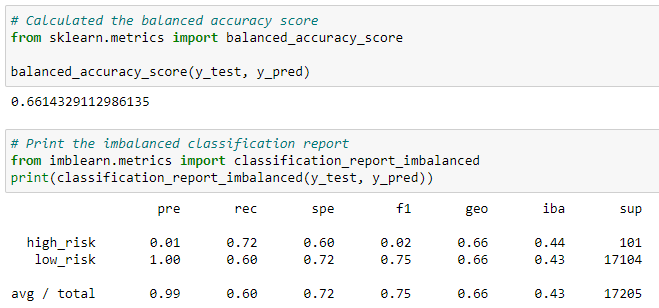
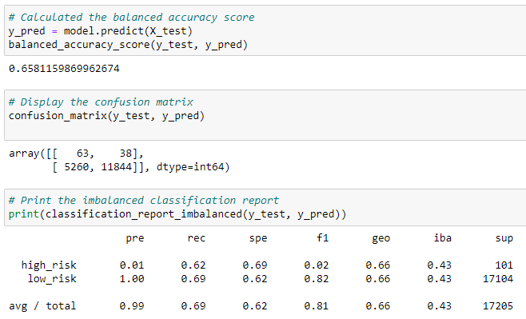
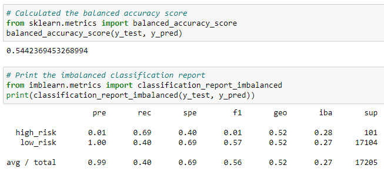
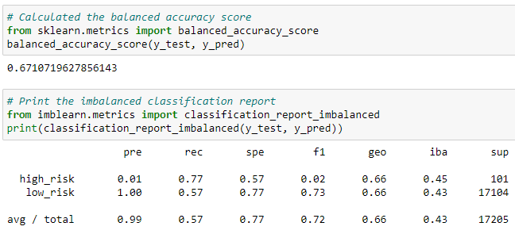
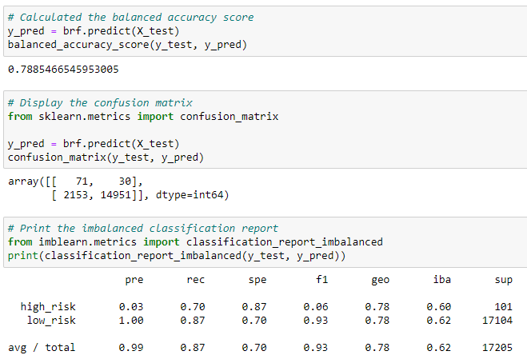
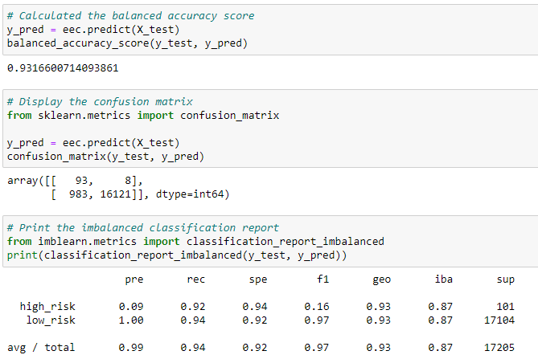

# Credit Risk Analysis

## Overview of the Project and Purpose

The purpose of this project is to utilize Machine Learning algorithms and techniques to build and evaluate models using resampling.

The following are achieved by using the credit card credit dataset from LendingClub:

1. Oversample the data using the RandomOverSampler and SMOTE algorithms, and undersample the data using the ClusterCentroids algorithm.
2. Use a combinatorial approach of over- and undersampling using the SMOTEENN algorithm.
3. Compare two new machine learning models that reduce bias, BalancedRandomForestClassifier and EasyEnsembleClassifier, to predict credit risk.

## Results

### 1. Naive Random Oversampling

- Balanced Accuracy: 66%
- Precision: The precision is low for High-risk loans and is high for Low-risk loans.
- Recall: High/Low risk = .72/.60

### 2. SMOTE Oversampling

- Balanced Accuracy: 66%
- Precision: The precision is low for High-risk loans and is high for Low-risk loans.
- Recall: High/Low risk = .62/.69

### 3. Undersampling

- Balanced Accuracy: 54%
- Precision: The precision is low for High-risk loans and is high for Low-risk loans.
- Recall: High/Low risk = .69/.40

### 4. Combination Under-Over Sampling

- Balanced Accuracy: 67%
- Precision: The precision is low for High-risk loans and is high for Low-risk loans.
- Recall: High/Low risk = .77/.57

### 5. Balanced Random Forest Classifier

- Balanced Accuracy: 79%
- Precision: The precision is low for High-risk loans and is high for Low-risk loans.
- Recall: High/Low risk = .70/.87

### 6. Easy Ensemble AdaBoost Classifier

- Balanced Accuracy: 93%
- Precision: The precision is low for High-risk loans and is high for Low-risk loans.
- Recall: High/Low risk = .92/.94

## Summary

The EasyEnsembleClassifer model yielded the best results with an accuracy rate of 93% and a 9% precision rate when predicting "High Risk" candidates. The sensitivity rate was also the highest at 92% compared to the other models. The result for predicting "Low Risk" was also the highest with the sensitivity rate at 94% and an F1 score of 97%. Therefore, if a model needed to be recommended to perform this type of analysis, then this one would be the clear choice.
